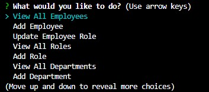

# 12-employee-tracker

## Description

This is a CLI application to populate, update, and view an employee, role, and department database tables. This can be used to track employee roles as well as their personal information related to their role. 

Please find view [this link](https://drive.google.com/file/d/18hR8OFG7ouh1Sp7mIz6TBIIvycxZXc_W/view) to preview how the application functions.

## Table of Contents

- [Installation](#installation)

- [Usage](#usage)

- [Contributing](#contributing)

- [Questions](#questions)

## Installation

1. Go to root directory
2. Type `npm i inquirer@8.2.4` in the terminal (install node modules)
3. Type `npm install --save mysql2` [Reference docs](https://www.npmjs.com/package/mysql2)
4. Type `npm install dotenv`
5. Type npm install console.table --save
6. Open the mysql shell using `mysql -u root -p` (enter your password when prompted)
7. Within mysql shell, type `USE employee_db;`
8. Type `source db/schema.sql`
9. Leave mysql shell by either typing `exit` or Ctrl+`c`
10. Back in the main bash terminal, type either `node index.js` or `npm start` to begin the CLI application

## Usage

For your team of employees, view their role information including their title, salary and department. You can also view what the employee's manager name is. 

## Contributing

[Katie Vlasic](https://github.com/katievlasic)

## Questions

Contact [me](https://github.com/katievlasic) with any questions!
